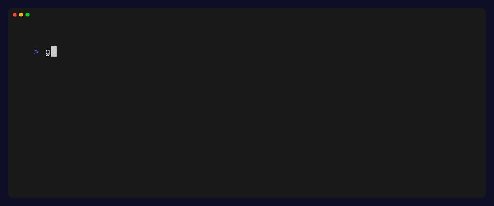

# boltx



A TUI tool for setting up Linux systems. Built for newcomers and experienced users who want a faster path to a working machine.

## Status

Early development — SYS tab options (hostname, locale) are fully implemented and applied on GO!. Other tabs are stubs. UI includes theme cycling, a full-width separator above the help line, and root/non-root detection.

## Categories

The review screen is organised into tabs:

| Tab | Description |
|-----|-------------|
| SYS | Hostname, locale, timezone |
| USR | Users (sudo, groups), SSH setup, shell, dotfiles |
| SEC | Firewall (ufw), fail2ban, policies |
| NET | Web servers (cockpit), proxy managers (traefik, nginx) |
| PKG | Update/upgrade, essential packages, cleanup |
| GO! | Summary and final apply step |

## Built with

- [Bubbletea](https://github.com/charmbracelet/bubbletea) — TUI framework
- [Lipgloss](https://github.com/charmbracelet/lipgloss) — terminal styling
- [Bubbles](https://github.com/charmbracelet/bubbles) — UI components

## Keybindings

| Key | Action |
|-----|--------|
| `↑↓` / `jk` | Navigate |
| `←→` / `hl` | Switch tabs (review screen) |
| `enter` / `space` | Select / toggle option |
| `r` | Reset current option to default |
| `R` | Reset all options in current tab |
| `t` | Cycle theme (Purple → Teal → Amber) |
| `?` | Toggle help |
| `q` / `esc` | Back / quit |

## Roadmap

- [x] Main menu
- [x] Use case detection (VPS vs dev machine)
- [x] Setup categories (authentication, security, packages, networking…)
- [x] Per-category configuration steps (toggleable options with tab navigation)
- [x] Review & Apply tab (final step, apply not yet wired)
- [x] Theme switching (`t` key, extensible)
- [ ] Apply changes

## Usage

**Requirements:** Go 1.24+

### Run without installing

```bash
go run .
```

### Build a binary

```bash
go build -o boltx .
./boltx
```

### Install to `$GOPATH/bin`

```bash
go install .
boltx
```

## Support

If you find this useful, consider buying me a coffee: [ko-fi.com/ericllaca](https://ko-fi.com/ericllaca)
