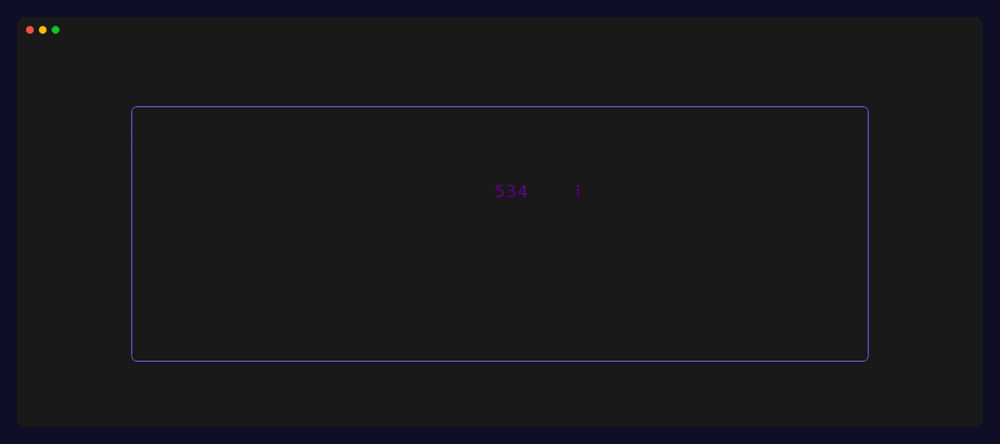
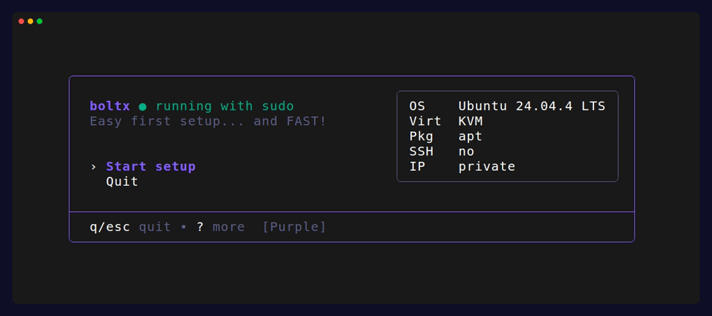
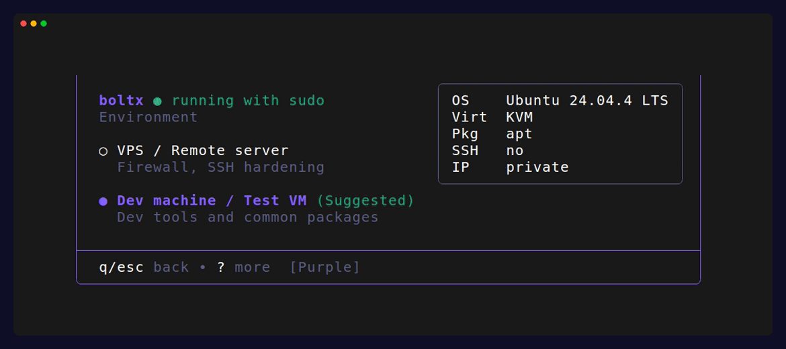

# boltx





A terminal tool for setting up Linux systems. Whether you're spinning up a VPS or a dev machine, boltx walks you through the usual setup steps — hostname, users, security, packages — and applies them all at once when you're ready.

Built for people who know what they want but don't want to type the same commands every time.

## What it configures

| Tab | What you can set |
|-----|-----------------|
| SYS | Hostname, locale, timezone |
| USR | Create/rename/delete users, passwords, sudo, SSH keys |
| SEC | SSH hardening (root login, key-only auth, port), UFW firewall |
| NET | Ports, proxies, fail2ban |
| PKG | System updates, essential packages |
| RUN | Shell, automation, and system lifecycle tools |
| GO! | Review and apply everything |

Pick your options across tabs, then hit GO! to apply them all.

## Status

Early development. SYS, USR, and SEC tabs fully working. NET, PKG, and RUN tabs are placeholders.

## Keybindings

| Key | Action |
|-----|--------|
| `↑↓` / `jk` | Navigate |
| `←→` / `hl` | Switch tabs |
| `enter` / `space` | Select / toggle option |
| `r` | Reset current option to default |
| `R` | Reset all options in current tab |
| `t` | Cycle theme (Purple → Teal → Amber) |
| `?` | Toggle help |
| `q` / `esc` | Back / quit |

## Built with

- [Bubbletea](https://github.com/charmbracelet/bubbletea) — TUI framework
- [Lipgloss](https://github.com/charmbracelet/lipgloss) — terminal styling
- [Bubbles](https://github.com/charmbracelet/bubbles) — UI components

## Install & run

**Requirements:** Go 1.24+

```bash
# Run directly
go run .

# Build a binary
go build -o boltx .
sudo ./boltx

# Install to $GOPATH/bin
go install .
```

Most apply steps require root (`sudo`).

## Roadmap

- [x] Main menu with use-case detection (VPS vs dev machine)
- [x] Per-category options with tab navigation
- [x] Theme switching
- [x] SYS tab: hostname, locale, timezone
- [x] SEC tab: SSH hardening, UFW firewall
- [x] Exit prompt after apply
- [x] USR tab: multi-user management, rename, passwords, sudo, SSH keys
- [ ] NET, PKG, RUN tab options

## Support

If you find this useful, consider buying me a coffee: [ko-fi.com/ericllaca](https://ko-fi.com/ericllaca)
